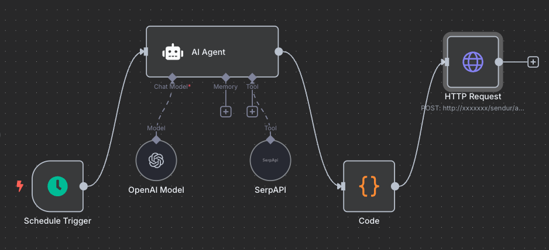
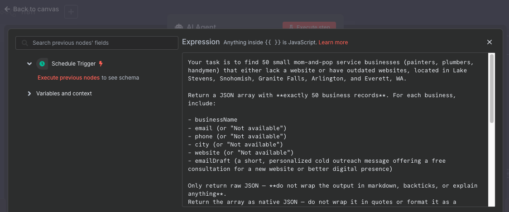
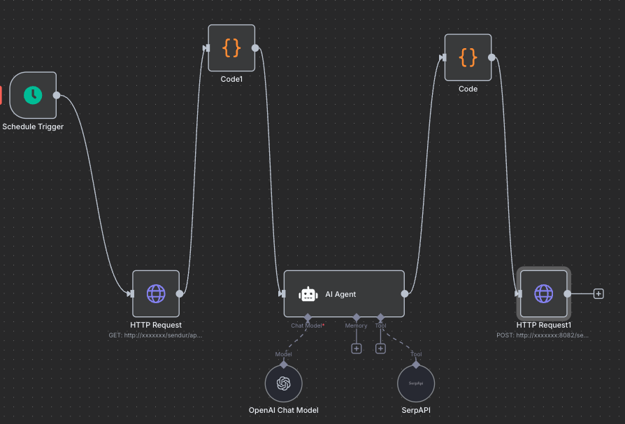

# Sendur

Sendur is an AI-augmented lead generation automation platform that leverages n8n workflows and an AI agent to streamline the process of identifying, reviewing, and engaging potential business leads.

## How It Works

### Automated Lead Discovery
Sendur uses <a href="https://n8n.io/">n8n</a>, an AI Agent, and SerpAPI to search the web, on an automated schedule, for businesses based on a given 
description or industry profile. We've all heard of prompting... yes, you need to build a prompt to share with your AI 
Agent. Be warned, AI Agents can, and do, get things wrong so it's best that you are explicit in your details. In this 
setup, we ask our Agent to look up the business details of small businesses around the areas above North Seattle. 
We want our agent to send these leads back in a nicely built JSON structure (we can use this for persistence). The Agent
uses <a href="https://openai.com/">OpenAI</a> and SerpAPI as a tool. Tools are nice-to-haves that are available for your AI Agent to use, however your
Agent must have access to utilize these tools (API keys or other information you can let your Agent know about). If
you haven't, check out what <a href="https://serpapi.com/">SerpAPI</a> is. You see the node called `Code`, well 
n8n allows you to manipulate any data output you receive. In this case our Agent returns some JSON, hopefully a list of 
leads. This Code node allows us to conduct any other parsing, validation or structure manipulation on this output data. 
Honestly, we just want to ensure the AI Agent is giving us some useful data, in the right structure we can use in our 
Springboot application. Which leads us to the last `HttpRequest` node. This output is sent to our 
`/sendur/api/leads/receive-scheduled-leads` API running on our Springboot application. 

<a href="https://n8n.io/integrations/agent/">
  
</a>

### Lead & Email Generation
Once discovered, leads are enriched with relevant details and paired with AI-generated email drafts. Maybe you will 
generate some nice cash flow with automation, or maybe you have deep pockets. Either way, be aware: your AI Agent 
uses API keys for tools like OpenAI and SerpAPI and this can become costly! However, maybe you only run these schedules
once a day, or maybe you change this to be manually triggered. Just run some calculations before you set this loose. Many 
tools have free tiers so check those out too, and be creative!

<a href="https://n8n.io/integrations/agent/">
  
</a>

### Automating Data Record Updates
We discussed how AI Agents can get things wrong and create random false data (<a href="https://cloud.google.com/discover/what-are-ai-hallucinations">hallucinate</a>)
and/or incomplete data! Well, incorrect data is definitely a possibility when we use AI to automate actions. Part of the goal
is to receive correct, complete, and valuable business leads. So, we use n8n nodes like the `Code` node for validation and 
formatting, but what happens when our data is correct but unknown? Our AI Agent will still produce something. What we did
was protect our data output by explicitly telling our agent what to put when it can not find what it searches for: `"email": "Not available"`.
What if our search just wasn't deep enough, but we really want to produce as many business leads as possible? One option is to run 
another, deeper and more intentional, search. I don't know about you, but I don't want to do that work. We can, again, use the services of n8n and our
AI Agent. Here's another workflow, except this time we pull leads without emails from our datastore by calling our springboot API 
`/sendur/api/leads/no-email-scheduler`, we validate our data with the `Code` node, and send to our Agent. But we only want leads whose 
email has been found. Let's use another `Code` node to truncate the JSON returned from our Agent. Lastly, we can send these updated leads
back to our springboot api endpoint `/sendur/api/leads/update-emails` to update our datastore. Next, we'll talk about how we send off the 
generated emails with a click of a button. 

<a href="https://n8n.io/integrations/agent/">
  
</a>

### Human-in-the-Loop Review
You log into the Sendur web application to review and approve both the leads and their associated emails.

### Email Dispatch & Webhook Integration
Approved emails are sent via an n8n webhook trigger, initiating the outbound communication process.

### Lead Persistence & Workflow Expansion
All lead data is stored and updated in the system. As the project grows, additional automations and workflows (e.g., follow-ups, CRM sync, analytics) can be layered on top.

### Building and Running the Project

#### 1. Build the Project
Note: Ensure application.properties file is populated!
To build the backend and frontend, run the following commands:
``` bash
mvn clean install
```
```bash
npm run build
```

#### 2. Running the Project
After building, you can run the backend Spring Boot application using:
```bash
mvn spring-boot:run
```

The frontend can be served running:
```bash
npm run watch
```

#### 3. Testing the Project
Once the project is running, open up a browser and navigate to `localhost:8082` and you should see text saying `All is Good!`.

